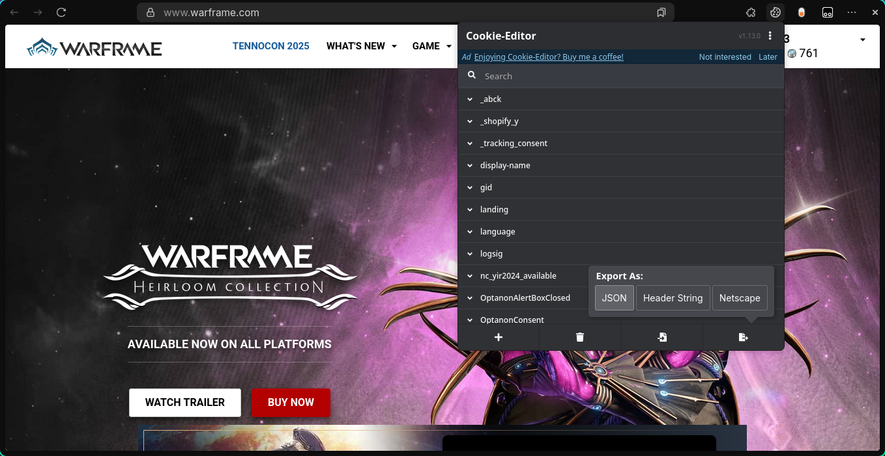
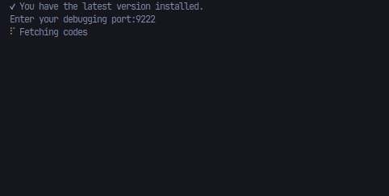

# Warframe Glyph Redeemer

## Table of Contents

1. [Introduction](#1-introduction)
2. [Download](#2-download)
3. [Prerequisites](#3-prerequisites)
4. [Installation](#4-installation)
5. [Usage](#5-usage)
6. [Roadmap](#6-roadmap)
7. [Contributing](#7-contributing)
8. [License](#8-license)

## 1. Introduction

The Warframe Glyph Redeemer is a Node.js application powered by Puppeteer, designed to automate the process of logging into your Warframe account and redeeming all available glyph codes.

**Disclaimer:** I originally developed this application for personal use to redeem Warframe glyph codes, feel free to point out any bugs or problems. Please be aware that this application interacts with your Warframe account and relies on web scraping techniques. The use of automated tools like this may potentially violate Warframe's Terms of Service.

## 2. Prerequisites

You will only need this if you want to contribute, if you simply want to use the Warframe Glyph Redeemer without dealing with the installation process skip to [Download](#4-download)

Before using the Warframe Glyph Redeemer, ensure you have the following prerequisites:

- [Git](https://git-scm.com/)
- [Node.js](https://nodejs.org/) (including npm)

Additionally, you will need a browser extension for cookie management based on your preferred web browser like
[Cookie Editor](https://cookie-editor.cgagnier.ca/). It's available for Chrome, FireFox, Safari, Edge and Opera

## 3. Installation

To get started, follow these installation steps:

1. Clone the repository:

   ```bash
   $ git clone https://github.com/Noxde/glyph-redeemer
   ```

2. Navigate to the project directory:

   ```bash
   $ cd glyph-redeemer
   ```

3. Install project dependencies:

   ```bash
   $ npm install
   ```

4. Launch the application:

   ```bash
   $ npm start
   ```

## 4. Download

You can download the pre-built executable for your operating system from the [Releases](https://github.com/Noxde/glyph-redeemer/releases) section of this repository.

Choose the version that matches your operating system and download it.

**Note:** Ensure that you have the necessary browser extension for cookie management, as mentioned in the [Prerequisites](#2-prerequisites) section, to use the application effectively.

## 5. Usage

Using the Warframe Glyph Redeemer is straightforward:

**Notes:**

- If you don't run the program from the terminal it will automatically close on error or when it finished redeeming the codes (it will still remove the chromium that installed)

- On windows after executing the .exe file you have to click on <ins>moreinfo</ins> and then "Run anyway"

### **Steps**:

1. Visit the [Warframe official website](https://www.warframe.com/) and log in to your account.

2. Use the cookie editor extension to export your cookies as JSON.

   

3. Paste the exported cookies into the following directory:

   ```
   glyph-redeemer/config/cookies.json
   ```

4. You are now prepared to start the Warframe Glyph Redeemer.

5. The application will download Chromium to your temporary files folder for use with Puppeteer and attempt to log in to your Warframe account.

6. It will then start redeeming the codes, displaying success or failure for each code.

   

7. After completing the code redemption, the application will remove the downloaded Chromium.

## 6. Roadmap

This application is designed for single-use code redeeming. However, I plan to add the following features in the future to enhance usability:

- **Redeem Multiple Codes:** Allow users to redeem multiple codes at once for faster redeeming.
- **Code List Updates:** I will regularly update the codes list to keep it current.
- **Remove the need to install chromium:** The program should first try to find your already installed browser, for now this is easier as it.
- **Simpler logging in:** Removing the need of a cookie editor, just simply login through the program.
- **Sign executable:** The idea is to avoid the Windows protected your PC warning, not sure if its by singing the executable.

## 7. Contributing

Contributions are welcome. Feel free to improve on the project.

## 8. License

This project is licensed under the [MIT License](LICENSE).
